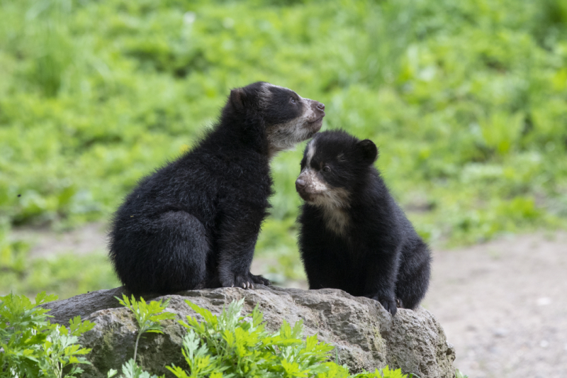
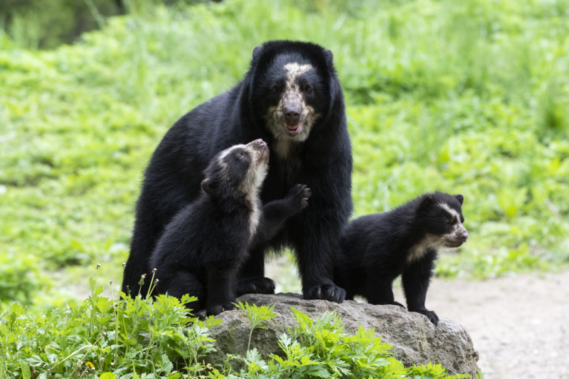
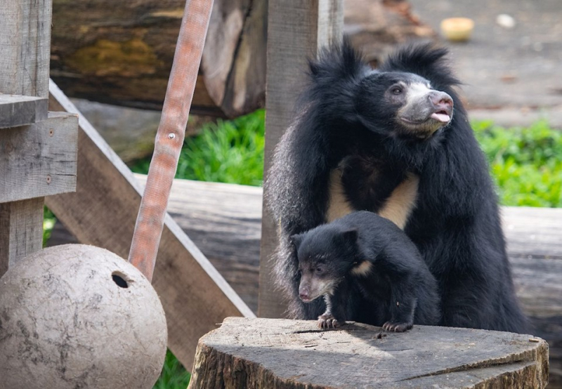

# Andean Bear Siblings Out and About at Queens Zoo

Two Andean Bear cubs born at the Queens Zoo recently made their New York City debut.

The cubs, one female and one male, were born in January to six-year-old mother, Nicole, and eight-year-old father, Bouba. After spending several weeks in their den bonding with their mother, they have now started venturing into the zoo’s outdoor habitat.

Queens Zoo animal care staff have named the cubs Brienne and Benny, and staff are closely monitoring their health and development. The time the cubs spend in the outdoor habitat will vary until they become fully acclimated to it.

“These little cubs are tremendous ambassadors for their species,” said Scott Silver, Queens Zoo Director. “Andean Bears are rarely seen in the wild, so it’s extremely special to have an opportunity to watch cubs grow. Guests will also learn about our efforts to protect Andean Bears in the wild.”

Andean Bears (Tremarctos ornatus) are the only bear species native to South America. They are also known as spectacled bears due to the markings on their faces that sometimes resemble eyeglasses. They have characteristically short faces and are relatively small in comparison to some other bear species. As adults, males weigh between 250-350 pounds while adult females rarely exceed 200 pounds.

Andean Bears are classified as “Vulnerable” by the International Union for the Conservation of Nature (IUCN). Estimates indicate that there are fewer than 18,000 remaining in the wild.

The Queens Zoo is breeding Andean Bears as part of the Species Survival Plan (SSP), a cooperative breeding program designed to enhance the genetic viability and demographic stability of animal populations in zoos and aquariums accredited by the Association of Zoos and Aquariums (AZA). There are currently only 39 Andean Bears in AZA-accredited zoos and only six potentially viable breeding pairs in the SSP population.

Bouba came to Queens from Bioparc de Doue la Fontainein in France to breed with Nicole, who was born at the Smithsonian’s National Zoo in Washington, DC and came to the Queens Zoo in 2015. This is the second time the pair has produced offspring at the Queens Zoo, and these cubs were two of only four Andean Bears born in zoos worldwide in the past year.

